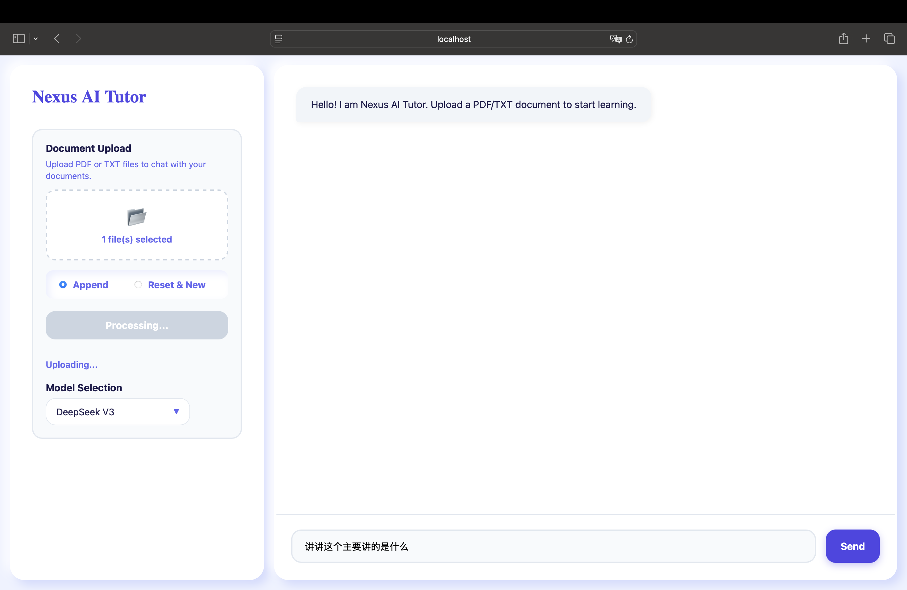

# Nexus-AI-Tutor

Nexus-AI-Tutor is a locally-run RAG document Q&A system. Users can upload PDF or TXT files, build a local vector index, and ask questions about the uploaded documents through a chat interface.

The project is designed for local learning and experimentation. It uses FAISS-CPU and a local embedding model so it can run without a dedicated GPU.



## Features

- Upload PDF and TXT documents
- Ask questions about uploaded documents through a chat UI
- Local vector retrieval with FAISS-CPU
- Local embedding inference with `BAAI/bge-m3`
- Multi-model chat support: DeepSeek, OpenAI-compatible ChatGPT, and Gemini
- Append or reset document index modes
- Docker Compose setup with frontend, backend, and nginx

## Architecture

- **Frontend**: React chat interface for document upload and Q&A
- **Backend**: FastAPI API for upload, retrieval, and chat
- **Retrieval**: FAISS-CPU vector store with local embeddings
- **Infrastructure**: Docker Compose and nginx reverse proxy

## Project Structure

```text
Nexus-AI-Tutor/
├── backend/                 # FastAPI backend
│   ├── app/
│   │   ├── api/             # API routes
│   │   ├── core/            # RAG pipeline and configuration
│   │   ├── models/          # Data models
│   │   └── services/        # Service layer
│   └── Dockerfile
├── frontend/                # React frontend
│   └── src/
├── nginx/                   # Reverse proxy
├── example_png/             # Demo screenshot
└── docker-compose.yml       # Service orchestration
```

## Getting Started

1. Copy the environment template.

```bash
cp .env.example .env
```

2. Edit `.env` and add the API keys for the models you want to use.

```env
DEEPSEEK_API_BASE=https://api.deepseek.com
DEEPSEEK_API_KEY=your-deepseek-api-key
OPENAI_API_KEY=your-openai-api-key
GOOGLE_API_KEY=your-google-api-key
```

3. Start the services.

```bash
docker-compose up --build
```

4. Open the app.

```text
Frontend: http://localhost:3000
Backend API: http://localhost:8000
Nginx entry: http://localhost:8080
API docs: http://localhost:8000/docs
```

## Runtime Data

Uploaded documents and generated FAISS indexes are local runtime data. They are intentionally excluded from Git because the FAISS docstore can contain document text chunks and metadata.

Generated files include:

```text
backend/faiss_index/
backend/temp_*
```

## Current Limitations

- Designed for local use and learning scenarios
- No authentication or user management yet
- Uploaded document storage and vector indexes are local
- Retrieval quality depends on document quality and embedding model performance

## Tech Stack

- **Frontend**: React, Vite, Axios, React Markdown
- **Backend**: FastAPI, Python, LangChain, Pydantic, Uvicorn
- **Vector Store**: FAISS-CPU
- **Embedding Model**: BAAI/bge-m3
- **LLM Providers**: DeepSeek, OpenAI-compatible API, Gemini
- **Infrastructure**: Docker Compose, nginx
